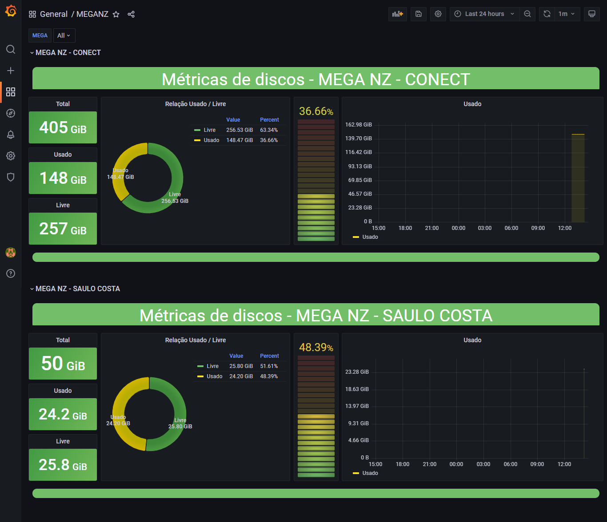
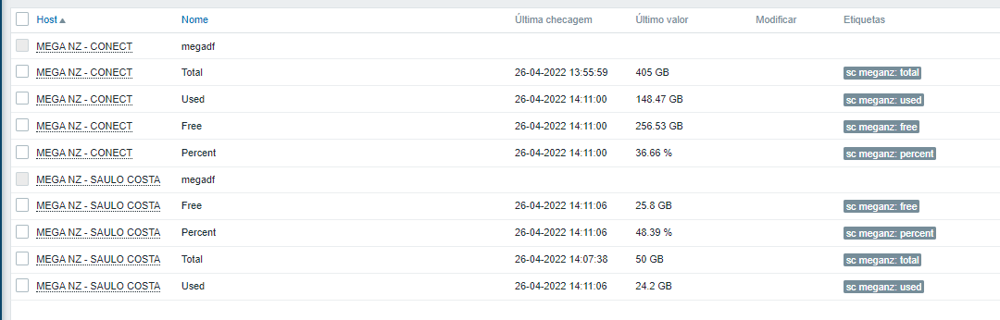
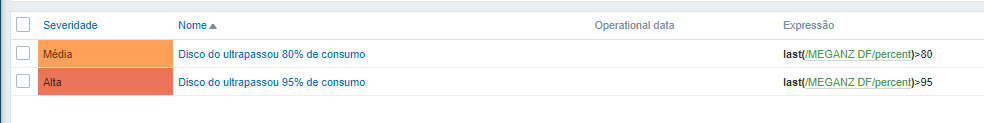

# Monitoramento [Mega.nz](https://mega.nz/)

<center>
    
</center>

## Referências

[Megatools Linux install and Basic Introduction](https://linuxconfig.org/megatools-linux-install-and-basic-introduction)

[megatools (7) - Linux Man Pages](https://www.systutorials.com/docs/linux/man/7-megatools/)

## Megatools - Instalação e Configuração

> Intalação do megatools

```sh
apt install megatools
```

> Arquivo de configuração

```sh
vim ~/.megarc
```

> **/.megarc**

```ini
[Login]
Username= noc@suaempresa.com
Password= SuperSenhaDoMegaNz
```

> Vamos testar a integração com o comando ***megadf -h***

```sh
$ megadf -h
Total: 405,0 GiB
Used:  148,5 GiB
Free:  256,5 GiB
```

## Python

### Script

[megadf.py](https://t.me/saulotarsobc)

## Zabbix + Grafana

[Template Zabbix 5.4](zbx_export_templates.xml)

[Dashboard Grafana](dashboard.json)

### Macros

```ini
$MEGA_EMAIL = Email da conta
$MEGA_PASS = Senha da conta
```

### Itens



> Certinho 😍


### Trigers


